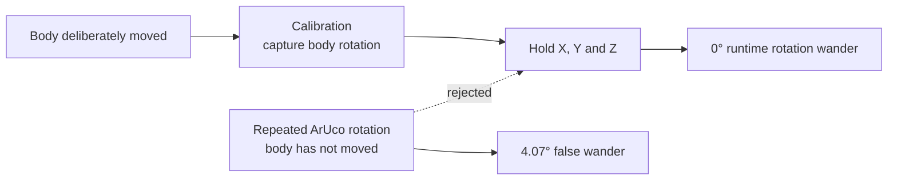

# Recordings from 3 August 2026

Two recordings kept out of fifteen. The rest were deleted rather than archived: a recording
where the markers were only all visible 29% of the time cannot be salvaged by analysing it more
carefully, and keeping it only invites someone to try.

One recording supplies calibration viewpoints and the other tests the resulting pose.

The marker layout was settled by the end of the day and measured centre-to-centre:
**ID0-ID1 135 mm, ID0-ID2 158 mm, ID1-ID2 160 mm**. Those numbers live in `RULER_MM` in
`simple_aruco_analysis.py` and are the only lengths in the system that no camera produced, which
is what makes them the tie-breaker whenever two camera estimates disagree.

| file | rows | all 3 seen | what it is |
|---|---|---|---|
| `walk_final_1785760244.csv` | 438 | 97% | **the calibration walk.** Six labelled viewpoints. The offsets in use came from this |
| `headmotion_1785761051.csv` | 645 | 97% | **the speed test.** still / slow / medium / fast, 2 to 123 mm/s |

`navel_calibration.cfg` is what the headset had at the end of the day.
`navel_calibration_singleframe_1510.cfg` is the single-button-press calibration it replaced, kept
because it is a good example of the failure mode: its ID2 offset was 16.5 mm longer than the tape.

## What these established

**The error depends on WHERE the head is, not how fast it moves.** Every viewpoint of `walk_final`
learned its own calibration for the same unmoving markers. Sorted by how far away the headset was,
against the tape (`analyze_viewpoints_distance.py`, ID2, which shows it most clearly):

    crouch      1.22 m    159.5 mm    +1.5
    stand_tall  1.40 m    160.1 mm    +2.1
    near        1.44 m    160.6 mm    +2.6
    right_side  1.62 m    161.7 mm    +3.7
    left_side   1.68 m    163.8 mm    +5.8
    far         1.85 m    167.2 mm    +9.2

Monotonic. Closest is nearly right, furthest is 9 mm long, and nothing moved in between. ID1 does
the same thing at roughly half the size. That is the whole finding, and the plot the script writes
is the same six rows drawn.

No slope is quoted, deliberately. A line through six points looked precise and was not: refitting
with each viewpoint dropped moved ID2 between +8.6 and +15.1 mm per metre, because the fit rests on
the two ENDS of the range and those are the two viewpoints with the fewest samples - crouch 45 rows
and far 62, against near's 120. The direction never changed sign under any of those refits, so the
table above says everything the slope did without implying a precision the data cannot support.

This is a comparison WITHIN one recording, which is what makes it trustworthy. The head-motion
version of this claim was not: it compared `stationary_near_B` at 80 cm against `headmotion` at
140 cm, which differ in range AND in ID2's position AND in head motion, so it could not attribute
the difference to any of them. Comparing within `headmotion` by speed phase instead gives
10.23 / 8.55 / 9.47 / 8.56 mm across a 60x range of head speed - flat, with "still" the worst.

An earlier figure of 11.4 mm per metre appeared here, from a script since deleted, and could not be
reproduced when it was checked. That is the third number in this file to outlive its source, so:
nothing goes in this README that a surviving script does not print.

**Offsets learned from different viewpoints disagree**, about markers that are glued down and
cannot move. The worst is ID2 from `left_side`: **69.8 mm and 12.20 degrees** away from the offset
learned from the whole walk - the `pos vs all` and `rot vs all` columns of `analyze_viewpoints_distance.py`.
That is what makes single-frame calibration unsafe, and why `make_calibration.py` learns from the
closest quarter of a whole walk instead.

Measured against the SHIPPED average, not against the worst other viewpoint. An earlier figure of
90 mm and 16 degrees appeared here and was the pairwise worst case - a bigger and more quotable
number, but not one anybody pays: what a bad viewpoint actually costs is its distance from the
offset that ends up on the headset. The pairwise version was dropped from the script for that
reason, which left the figure here with no source, exactly as happened to the range slope.

**With the body stationary, the fused rotation wandered 4.07 degrees:** X 3.30, world-up Y 1.22,
and Z 0.75 degrees (median rotation-vector components). `analyze_rotation.py` prints these
repeatability errors. The same analysis reports **7.36 mm total position wander:** X 1.63, Y 3.77,
and Z 5.08 mm (median absolute position components). For a direct visual comparison, the figure
converts rotation to equivalent movement at a stated 500 mm radius: X 28.80, Y 10.69, Z 6.50, and
total 35.52 mm. Both panels use the same millimetre scale.
They are not absolute angle errors; measuring those would require an independent known-angle jig.

The runtime decision is therefore deliberately simple:

The rig holds all three calibrated angles and captures them again only after deliberate movement.
The generated summary figure is [`ritation.png`](../../ritation.png); rerunning
`analyze_rotation.py` refreshes it from the recording.

## Running the analysis

Rebuild the headset's calibration from the walk - this is the one that gets used, not a test:

    python make_calibration.py data/today/walk_final_1785760244.csv OLD.cfg NEW.cfg

Check a calibration is still good, per viewpoint, against the tape:

    python analyze_viewpoints_distance.py data/today/walk_final_1785760244.csv

Re-verify the three conclusions if anything about the setup changes:

    python analyze_rotation.py data/today/walk_final_1785760244.csv data/today/headmotion_1785761051.csv
    python analyze_calibration_weighting.py data/today/walk_final_1785760244.csv

## Approaches that were tested and rejected

Recorded here because the scripts that tested them have been deleted, and without a note someone
will propose them again.

**Rebuilding ID0 from marker POSITIONS instead of stored 6DOF offsets.** The appeal was obvious:
positions are good to a few mm while rotations wander 4 degrees, so fitting the rigid marker
triangle to three measured points should never read a bad rotation at all. Measured, it was WORSE
- 8.36 mm against 7.39 mm, and 29 mm against 18 mm at p95. Two reasons: a rotation derived from
three points carries an error of roughly (position noise / baseline), which on a 150 mm triangle
with 5-7 mm of noise is already 2-3 degrees; and the fit is exactly determined, so one bad marker
passes straight through, where averaging three separate estimates dilutes it.

**Gravity as the missing constraint when only two markers are visible.** Two positions fix five of
six degrees of freedom, and gravity looked like the natural source for the sixth. It gave 55.57 mm,
because the useful marker pairs sit only 28-33 degrees from vertical and gravity says almost
nothing about roll about a near-vertical axis.

**Viewing angle as the cause of the per-viewpoint error.** Plausible - a planar square seen
head-on is its worst case - but the correlation was -0.15 and +0.33 for the two markers, and every
detection in the data sits within 0-30 degrees of head-on anyway, because markers lying flat on a
supine mannequin cannot be seen obliquely by walking around them. RANGE is what matters instead.
